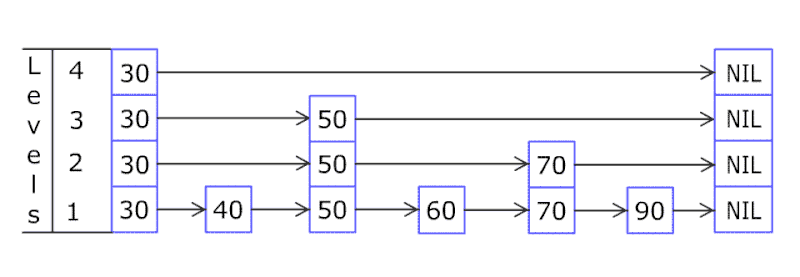

# RedisBoard

RedisBoard is a Go library for Redis-backed leaderboards with global and entity-based rankings (e.g., top players worldwide or by country). Built for apps like games or quizzes, it’s designed to manage users, scores, and groups efficiently. Using Redis sorted sets, it provides a clean API with atomic updates and scalable performance.

## Why Created

Leaderboards are tough at scale. In-memory heaps struggle with large user bases, and raw Redis queries require messy key and pipeline handling. RedisBoard simplifies this with an API to add users, update scores, fetch ranks, and group by entities (e.g., US, UK). It’s for developers who want solid rankings without digging into Redis details or hitting memory walls.

## Prerequisites

- **Go**: 1.22+.
- **Redis**: 6.0+ (e.g., `docker run -d -p 6379:6379 redis`).
- **Dependencies**:
  - `github.com/redis/go-redis/v9` (Redis client).
  - `github.com/gorilla/mux` (optional, for example server).
- Basic Redis (keys, sorted sets) and Go (structs, errors) knowledge.

## Basic Idea

RedisBoard stores users—each with an ID, score, and optional entity (e.g., “US”)—in Redis, using:
- **Global sorted set** (`game1:global`) for overall rankings.
- **Entity sorted sets** (`game1:entity:US`) for group rankings.
- **Hash** (`game1:user:entities`) to map users to entities.

Configure it with a `Config` struct (namespace, top-k size, score precision). You can:
- Add users with scores/entities.
- Update scores or entities (e.g., US to UK).
- Get ranks, top-k lists, or user data (score, ranks, top players).

Operations are atomic (via pipelining) and designed to scale to 1 million users and 200 entities with O(log n) performance, leveraging Redis sorted sets.

## Namespace

Each leaderboard uses one `Namespace` (e.g., `game1`) to prefix Redis keys (`game1:global`, `game1:entity:US`). Why?
- **Isolation**: Prevents key clashes if multiple leaderboards (e.g., `game1`, `game2`) share Redis. A “Chess” board (`chess:global`) won’t mix with “Tetris” (`tetris:global`).
- **Flexibility**: Supports separate boards (e.g., “daily”, “weekly”) in one Redis instance.
- **No Cost**: Just a prefix for clean organization.

Set it once (e.g., `game1`) for your app. Need another board? Use a new namespace (e.g., `game2`). Example:

```go
cfg1 := redisboard.Config{Namespace: "game1", RedisAddr: "localhost:6379"}
lb1, _ := redisboard.New(cfg1) // Keys: game1:global, game1:entity:US, ...

cfg2 := redisboard.Config{Namespace: "game2", RedisAddr: "localhost:6379"}
lb2, _ := redisboard.New(cfg2) // Keys: game2:global, game2:entity:US, ...
```

## Why Better Than Raw Queries or Heaps?

RedisBoard streamlines leaderboard tasks, outperforming alternatives:

- **Vs. Raw Redis Queries**:
  - **Simpler**: Manages keys (e.g., `game1:entity:US`) and pipelines, sparing you `ZADD`, `ZREVRANK` boilerplate.
  - **Safer**: Atomic score/entity updates avoid race conditions.

- **Vs. Normal Heap**:
  - **Heaps Shine For**: Top-k queries (O(log n) pops), ideal for small, in-memory data.
  - **RedisBoard Excels For**:
    - **Top-k and Random Ranks**: O(log n) for top-k (`GetTopKGlobal`) and any user’s rank (`GetRankGlobal`); heaps need O(n) for random IDs.
    - **Entities**: Native group rankings (up to 200 entities) without extra heaps.

Redis has slight latency vs. in-memory, but for persistent leaderboards with mixed queries, it’s practical.

## Redis Sorted Sets and Skip Lists

RedisBoard uses **sorted sets** to store user IDs and scores, sorted for O(log n) operations (inserts, ranks, ranges). Redis combines:
- **Hash table**: O(1) score lookups (e.g., `GetUserScore`).
- **Skip list**: O(log n) ordered queries (e.g., top-k, ranks).

A skip list layers linked lists, with higher layers skipping elements for fast searches—like a binary search over lists. It’s O(log n) on average for inserts and lookups. For a visual dive, see [this skip list tutorial](https://youtu.be/UGaOXaXAM5M?si=okNOsSCIrcJZ4dtm).


RedisBoard uses:
- `{namespace}:global`: All users by score.
- `{namespace}:entity:{code}`: Per entity (e.g., `game1:entity:US`).
- `{namespace}:user:entities`: User-to-entity mappings.
